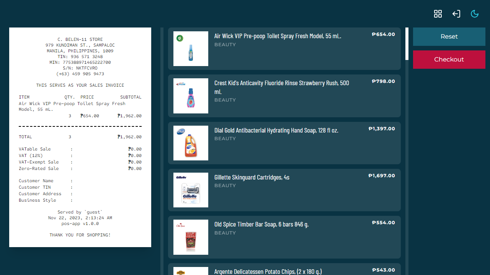
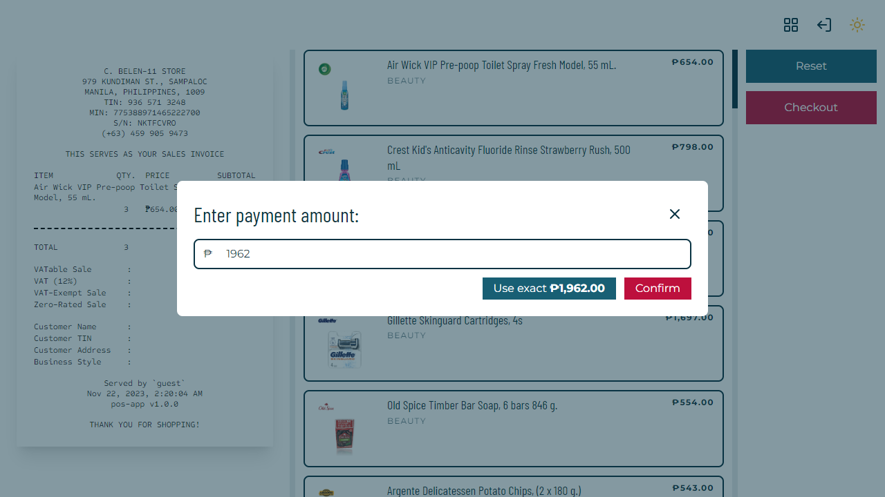
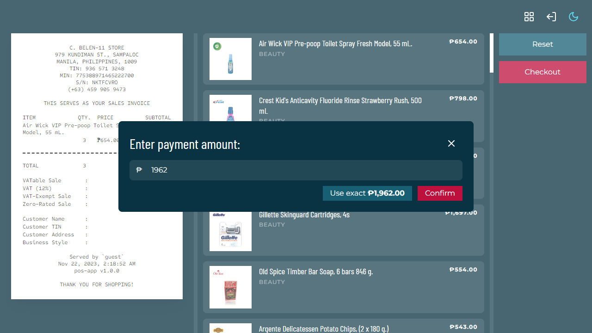

# `pos-app`

A point-of-sales and inventory management application

## Dependencies

- `electron-vite`
  - Electron
  - Vite
  - React
  - Typescript
- Tailwind
  - `tailwind-scrollbar`
- Drizzle ORM
  - `better-sqlite3`
- `argon2`, for password hashing
- `html-to-image`, for exporting elements as images

### Dev Tools

- Prettier
- ESLint
- CSpell

### Fonts

> Pairing sourced from [Fontpair](https://www.fontpair.co/pairings/barlow-condensed-montserrat)

- [Montserrat](https://fonts.google.com/specimen/Montserrat)
- [Barlow Condensed](https://fonts.google.com/specimen/Barlow+Condensed)

### Icons

- React Icons
- Tabler, for PNG [app icon](https://tabler-icons.io/icon/currency-peso)

## Screenshots

|           Light Mode           |           Dark Mode           |
| :----------------------------: | :---------------------------: |
|  |  |
|  |  |
|  |  |
|  |  |
|  |  |
|  |  |
|  |  |
|  |  |

## Project Setup

### Install

```bash
$ pnpm install
```

### Development

```bash
$ pnpm dev
```

### Build

> Running the `'postinstall'` script may be required for dependencies that used something like `node-gyp`.
>
> For instance, `'postinstall'` was needed to successfully build the app after installing `better-sqlite3`.
>
> - https://www.electronjs.org/docs/latest/tutorial/using-native-node-modules
> - https://www.electron.build/index.html#quick-setup-guide

```bash
# For Windows
$ pnpm build:win

# For macOS
$ pnpm build:mac

# For Linux
$ pnpm build:linux
```
